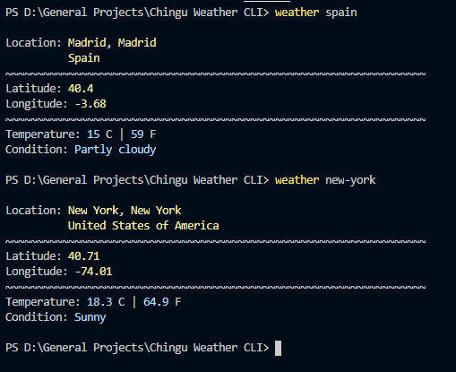
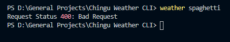

# Chingu-Weather-CLI

[Tier 2 Chingu Weather CLI using Weather API](https://github.com/chingu-voyages/soloproject-tier2-chinguweather)

## Breakdown
The bin folder contains the cli file used by `npm link` and checks to make sure that only one argument aka location is used when calling the command. If more than one argument is passed it will log a simple error telling you that only one argument can be used. 

Under the lib folder, the request handler is housed. [WeatherAPI.js](./lib/WeatherAPI.js) contains the request function, which takes the location parameter, and returns a formatted response object. The formatting of the response object is handled in a separate function to make it easier to view. 

## Usage
The `weather` command is linked to this project requiring only one argument, the location. This location argument can be written in several different ways, including the city name, US zip code, or ip address. These are parameters of the [API](https://www.weatherapi.com/docs/) that was used. 

Requests are made in the following format

If there is an Error you will be notified

